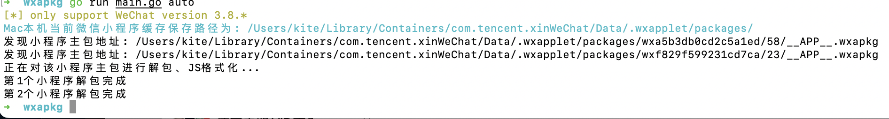

# Mac使用

```bash
./main auto   # 自动化搜索mac对应路径并解包、JS美化、以及输出，支持批量

# 单一命令
./main help
./main list
./main unpack --in xxxx路径 --format -v
./main clean # 补充新功能 清理小程序缓存
```



改自：https://github.com/ac0d3r/wxapkg